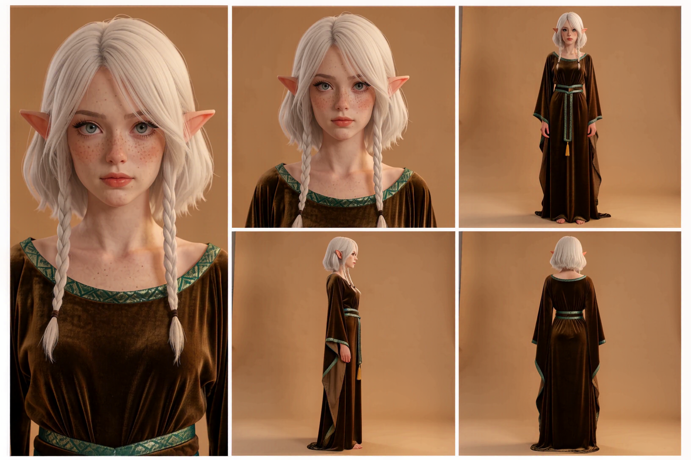
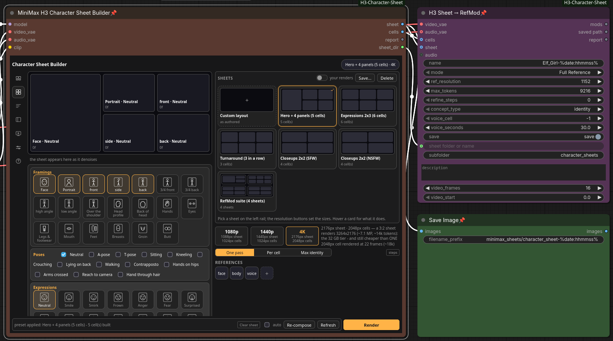
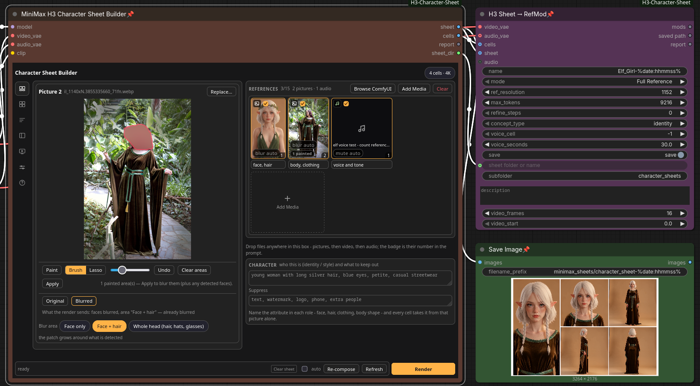

# 5tar5ystem MMH3 Character Sheet Builder

**Repo**: [The5toryofthe5ecret5tar5ystem/5tar5ystem-MMH3-Character-Sheet-Builder](https://github.com/The5toryofthe5ecret5tar5ystem/5tar5ystem-MMH3-Character-Sheet-Builder) ·
**License**: GPL-3.0 · **ComfyUI node**: `MiniMaxH3CharacterSheet` · **Installs as**: a
custom-node folder (any name), typically `ComfyUI-H3-Character-Sheet`
**Version**: 2.0.0 · [`CHANGELOG.md`](CHANGELOG.md) ·
[releases](https://github.com/The5toryofthe5ecret5tar5ystem/5tar5ystem-MMH3-Character-Sheet-Builder/releases) ·
[`docs/civitai-post-2.0.md`](docs/civitai-post-2.0.md) is the short public writeup for 2.0
(features, model links, install steps); [`docs/civitai-post.md`](docs/civitai-post.md) is the
1.1.0 one it replaces

Standalone **MiniMax H3 character sheet builder** for ComfyUI: give it photos, videos
and audio of a person, say what each reference is for, pick a matrix of views /
poses / expressions, and get a composited character sheet you can feed straight
back into a **ref2va** workflow as a single reference image.

No other custom node pack is required. The renders are done by **ComfyUI core
MiniMax H3 nodes** (`MiniMaxH3ReferenceToVideo` -> `MiniMaxH3SigmaShift` -> sampler
-> `VAEDecode`); this pack adds the sheet: the cell matrix, the reference roles, the
frame picker and the compositor.

* Folder / node type: `ComfyUI-H3-Character-Sheet` / `MiniMaxH3CharacterSheet` (a
  workflow contract - the display name is cosmetic, the type is not).
* Panel tabs: **References · Cells · Prompt · Results · Settings · Help**.
* The **Help tab** carries this guide in the node, with a live ✓/✗ check of the model
  files below, so you can see what is missing from inside ComfyUI.

## What it does

**References with roles.** Drop up to 9 pictures, 3 videos (with their soundtracks) and 3 audios;
each one gets a free-text role - "face and hair", "body and clothes", "this voice". The role text
is what the prompt says, and the render wires exactly the references a cell can use, so one picture
can carry identity while another carries the outfit.

**A matrix of cells.** 15 views (face close-up, portrait, front, 90 deg profile, back, 45 deg
views, over-shoulder, hands, legs...), 13 poses (neutral, A/T-pose, sitting, kneeling, walking,
hands on hips...) and 20 expressions - including arousal / pleasure / orgasm, written as face
states. Tick what you want, press *Build cells*, and every cell prompt is generated from the
vocabulary (framing, pose, expression, what that framing cannot show).

**Prompts you can read before you render.** The Prompt tab shows the exact per-cell text -
identity, the reference legend with each role, framing, pose, expression, your own extra words and
the suppression list - straight from the pack's planner: no GPU, no queueing, no guessing.

**Face blur for non-identity references.** Auto (blurs a reference whose role does not mention the
face) / on / off per tile, three scopes (face, face + hair, whole head) and hand-painted areas for
tattoos, logos or a second person. It works on **pictures, reference clips and sounds** - a
clip is detected on sampled frames, tracked between them, blurred frame by frame and written back
with its audio track; a sound has no pixels, so it is **muted** instead (silence at its own length
and channels). Blurred copies are written to `input/h3_character_sheet/derived/` and cached; your
original file is never modified.

**Latent continuation between cells** (*Auto* chains cells that share a camera distance, *On* / *Off*
per cell) so a row reads as one take instead of unrelated frames.

**Presets.** Shipped whole-node presets (two full character sheets - balanced and fidelity) plus
your own, saved into ComfyUI's user folder and re-appliable to the next sheet.

**A sheet, and the takes it came from.** One composited sheet with captions plus per-cell frames
(every frame of every cell is kept), the picked stills, and - when *Export clips* is on - each
cell's clip with the audio H3 generated. Re-picking a frame and re-compositing costs no GPU time.

**Export it as a RefMod - appearance *and* voice.** [ComfyUI-MiniMaxH3Mod](https://github.com/Luisacaotica/ComfyUI-MiniMaxH3Mod)
"RefMods" are tiny no-training reference adapters that ride H3's own reference path. `H3 Sheet →
RefMod` turns the sheet into one: the picked cells stacked, the composite as a second member, and a
voice member from the sheet's own reference audio (or its cell clips, or a clip you connect).
Written to
`models/refmods/`, where `Load H3 RefMods` lists it - no training, no second pass.

**Watch it render, and re-roll a single cell.** The panel's **LIVE** strip plays a looping clip of
the cell being denoised (decoded on the CPU, so it never competes with the sampler), and
**↻ new seed** cancels the run to render *that one cell* again with a fresh seed - the other cells
keep the frames they already have. On by default; see [the live strip](#the-live-strip-a-looping-clip-per-sampling-step).

## Screenshots

A five-cell sheet straight out of the node - one image, one render:



The `Hero + 4 panels` layout at the `4K` size, 3264 x 2176 in a single 5-frame H3 pass: headshot,
chest-up portrait, full body front, 90 degree side, back, all neutral, on the flat neutral tan
backdrop. The panels are sliced back out of this one image into `cells/` and `frames/`, so the frame
picker, the Results tab and the RefMod export read a one-pass sheet panel by panel. The
[per-cell pass](#one-pass-sheet-the-default) is one switch away when a panel has to be exactly
right; see [how long it takes](#how-long-it-takes) for what each tier costs.

The panel, on a real graph: the sheet node, `H3 Sheet → RefMod` (appearance **and** voice from the
same sheet) and the `Save Image` that writes it, all in one queue.

| Cells - layout cards, glyph framings, the sizes and the mode row | References - roles per tile, and a blur area painted by hand |
| --- | --- |
|  |  |

The **Cells** shot is a fresh node: `Hero + 4 panels` lit, every card drawing its own arrangement
(*your renders* is off, so the cards show the plan - switch it on and each one wears your own last
render of that sheet), `4K` set, **One pass** as the mode, and the arrangement the preset built
waiting in the stage.

The **References** shot is mid-edit on the same character: the *body, clothing* reference
(`Picture 2`) has a hand-painted area over the head - the red patch - so the picture that must not
lend a face or hair arrives with neither. Its tile badge reads `blur auto · 1 painted`, *Blur area* is
`Face + hair`, and the line under the preview says exactly what the render will send.

## Models you need

Four files plus one optional detector. The in-node **Help** tab checks all five
against your running install and tells you the folder to drop each one in.

| What | File | Where it goes | Get it from |
|---|---|---|---|
| Diffusion model | a **TURBO beta5** H3 checkpoint, e.g. `10Eros_Max_h3_TURBO-hybrid_beta5_w4a8_14gb_optimized.safetensors` (14GB) or the `..._int8` 20GB build | `models/diffusion_models/` (a subfolder is fine) | [TenStrip/10Eros-Max](https://huggingface.co/TenStrip/10Eros-Max/tree/main) - or ComfyUI's own [repack](https://huggingface.co/Comfy-Org/MiniMax-H3/tree/main/diffusion_models) (`minimax_h3_ref2va_pruned_int8_convrot`) at ~20 steps |
| Text encoder | `qwen3vl_32b_minimax_h3_nvfp4_awq.safetensors` | `models/text_encoders/` | [Comfy-Org/MiniMax-H3 · text_encoders](https://huggingface.co/Comfy-Org/MiniMax-H3/tree/main/text_encoders) - `CLIPLoader` with type **minimax** |
| Video VAE | `minimax_h3_video_vae_fp16.safetensors` | `models/vae/` | [Comfy-Org/MiniMax-H3 · vae](https://huggingface.co/Comfy-Org/MiniMax-H3/tree/main/vae) |
| Audio VAE | `minimax_h3_audio_vae_fp32.safetensors` | `models/vae/` | same repo - H3 generates audio with every clip, so this is not optional |
| Face detector *(optional)* | `face_yolov8m.pt` | `models/ultralytics/bbox/` - the models folder next to ComfyUI itself, which may differ from your `extra_model_paths.yaml` roots | [Bingsu/adetailer](https://huggingface.co/Bingsu/adetailer/tree/main), or install [ComfyUI-Impact-Pack](https://github.com/ltdrdata/ComfyUI-Impact-Pack) which brings the file and the `ultralytics` package |

**Steps**: 8 is the default everywhere, because the community TURBO checkpoints bake the
turbo delta into the weights and their own recipe for `res_multistep` / `simple` is 6-8
steps. A non-turbo checkpoint wants 20-30 - that is one field in the **Settings** tab.
With a TURBO file, do **not** also load a turbo LoRA, and skip cache/Spectrum nodes on
reference runs (the 10Eros README's advice: they cost accuracy).

The face blur is the only thing that needs the detector, and it degrades gracefully: with
no model it reports "no face model found" and wires your original reference untouched.

**Optional, for the live preview**: a `taeh3` tiny VAE in `models/vae_approx/` - the file
ComfyUI's own H3 previews (and KJNodes' preview override) use, so you may already have it. With it
the LIVE strip plays real frames; without it the strip falls back to latent2rgb: blurrier, still
looping, nothing to install, and the render is unaffected either way.

## How long it takes

Measured on an **RTX 5090 (32 GB)** with a TURBO H3 checkpoint at 8 steps and `res_multistep` / `simple` -
i.e. the shipped presets, unchanged. A sheet is five cells, so the per-cell figure is the wait
between live-preview cells:

| Render | Cells | Per cell | Whole sheet |
| --- | --- | --- | --- |
| **One-pass sheet at 4K** (2048px cells, 3264 x 2176) | one render | - | **160-170 s** |
| **Full Character Sheet - Balanced** (1024px cells, 2304 x 1536), per cell | 5 | ~10-13 s | **81 s** |
| **Full Character Sheet - Fidelity** (2048px cells, 5760 x 3840), per cell | 5 | ~60 s | **378 s** |

The first row is the **default render**: one clip, 5 frames, the whole sheet inside it, at the `4K`
resolution - a single wait of about two and a half minutes for a 3264 x 2176 sheet. That is what to
budget for a prompt you are still iterating on. The two per-cell rows are the classic pass, where
five renders of 22 frames each cost what they cost because a frame picker, per-cell clips and latent
continuation come with them; the Fidelity row is the Balanced row at twice the linear resolution, so
about four times the pixels and ~4.7x the wall clock (378 s against 81 s).

The one-pass figure was measured on a 5090 at 8 steps; these are single measurements on one machine -
a slower GPU, a non-turbo checkpoint at 20-30 steps, or the 1440p and 1080p sizes scale from them -
but the ratios between the rows are what to plan around.

## Nodes

| Node | What it does |
|---|---|
| `MiniMax H3 Character Sheet Builder` | The whole feature: references + cells -> ONE H3 render for the whole sheet (the default) or one short render per cell -> this pack's own sink / grid. Outputs `sheet` (IMAGE), `cells` (IMAGE batch - for a one-pass render, the panels sliced out of the sheet), `report` and `sheet_dir` (the folder the run wrote, for nodes that read the sheet's own files). |
| `H3 Character Sheet Grid` | Composites a sheet from per-cell frames. Use it on its own to re-composite a finished sheet, or with any other H3 workflow. |
| `H3 Sheet → RefMod` | Optional: exports the sheet as a [RefMod](https://github.com/Luisacaotica/ComfyUI-MiniMaxH3Mod) bundle - appearance members plus a voice member. Needs that pack for the VAE encoders; without it the node stops with the clone line. |

## Using it

0. **Open the ready-made workflow**: [`example_workflows/5tar5ystem MMH3 Character Sheet
   Builder.json`](example_workflows/5tar5ystem%20MMH3%20Character%20Sheet%20Builder.json) - drag it
   onto the canvas, or *Workflow -> Open* it. It wires the H3 ref2va model, the Qwen3-VL
   text encoder, both VAEs and a SaveImage, and pre-builds a 5-cell matrix: face close-up,
   portrait, full body front, 90 deg profile and back, all neutral pose and expression -
   the same five the *Full Character Sheet* presets build, so the file is the shortest path
   from "opened it" to "queued it". Drop your references into the panel, type who the
   character is, press Queue.
   [`... Builder + RefMod.json`](example_workflows/5tar5ystem%20MMH3%20Character%20Sheet%20Builder%20+%20RefMod.json)
   is the same graph with the export node appended: one queue renders the sheet, saves the
   PNG *and* writes the RefMod bundle (cells + composite + the sheet's own reference voice),
   so a sheet you like is a mod you can use without a second pass.

### Presets (two axes, at the top of the panel)

Both axes are **card rails**: each card is a picture of what it does - the layout cards draw the
cells they build, the quality cards draw one frame or a filmstrip, the suite card draws its four
boards - and clicking the picture applies it. Hover a card for the sentence that used to sit in a
hint bar; the line under the rails is just the fact ("One pass (default) · Hero + 4 panels — 5
cell(s)"). An implementation detail that is also a promise: the cards are drawn from each preset's
own ticks, so a card cannot show something different from what applying it does.

The **Layout** axis says *what to draw*: the cells, their arrangement and the cell shape. The
**Quality** axis says *how to sample it*: the mode, the step count, reference sizing, continuation,
clip export. Neither touches a size - the [resolution buttons](#resolution-the-three-buttons) own
those, so applying a layout can never undo a 4K choice. Both lists are served by the backend
(`h3_character_sheet/presets.py`), so the panel can only offer what the node implements, and each
preset declares where it departs from a fresh node's defaults.

| Layout preset | The cells it builds |
| --- | --- |
| **Hero + 4 panels (5 cells)** | The finished article: headshot, chest-up portrait, full body front, 90-degree side and from behind - neutral expression and pose, with the headshot as a tall hero panel on the left and the other four in a 2x2 block beside it, on the pack's flat neutral tan backdrop. |
| **Expressions 2x3 (6 cells)** | Six face close-ups in a 2x3 grid: neutral, eyes closed, smile, anger, crying and pleasure - the same framing every time, so the sheet compares expressions rather than angles. Square cells on a 3:2 sheet. |
| **Turnaround (3 in a row)** | Front, 90-degree side and back in one row on an ultrawide canvas: the classic turnaround strip. |
| **Closeups 2x2 (SFW)** | Four detail crops in a 2x2 square grid: eyes, mouth, hands, feet - see [Detail crops](#detail-crops). |
| **Closeups 2x2 (NSFW)** | The same board for the explicit detail a sheet also documents: breasts, groin, butt from behind, and the mouth with the **ahego** expression. |
| **RefMod suite (4 sheets)** | Not one sheet - four, in one queue: a hero + 4 panel sheet, the 2x3 expression board, the SFW detail crops and the NSFW ones. Each renders into its own folder under the run name, and each stays a complete sheet (cells, picks, report). See [The RefMod suite](#the-refmod-suite-four-sheets-one-queue). |

| Quality preset | What it sets |
| --- | --- |
| **One-pass sheet (default)** | The node's own defaults, spelled out: one H3 render for the whole sheet, 8 steps, `per framing` references. The sizes come from the resolution buttons and the cells from a layout. |
| **Per-cell renders (classic)** | One render per cell, with continuation `auto` - chains the cells only where the camera distance already matches. Pair it with the turnaround layout to get the chained turn (the subject turns inside each clip and settles, and the picked frame comes from that settled tail - watch the clips, not just the sheet). Needs a reference that shows the body: an outfit/body role such as "body and clothes", because the full-body cells re-pose what a chest-up or face reference cannot; without one the plan warns. |
| **Max identity fidelity** | The 2048px reference pipeline (several times slower) with independent cells, per-cell - that pipeline only pays off on a render that is about one panel. |

**Every preset samples at 8 steps** (and so does a fresh node). The community TURBO H3
checkpoints bake the turbo delta into the weights, and their own recipe for the
`res_multistep` / `simple` pair these presets set is **6-8 steps** - the pack used to default
to 25, which is the same image at roughly three times the cost. 8 is the top of that range, so
it gives the most motion. A non-turbo checkpoint (or a guidance/cfg workflow) still wants
20-30: that is one field in the **Settings** tab, and the presets never re-apply over it until
you pick one again.

A preset writes the node's own widgets (cell size, frames, steps, reference sizing,
continuation, clip export, layout, shape) plus the settings the panel owns, and it also
**builds its cells**: a preset that says which cells it is for (both *Full Character Sheet*
tiers, *Turnaround*, *Expression sheet*) creates them on the spot instead of only ticking the
boxes, so picking one and pressing Queue is the whole job. A preset with no ticks in it (the
settings-only ones) leaves an existing cell list alone, and *Clear cells* still empties it.
Editing a knob afterwards is expected; the applied preset id is recorded in the payload
(`render.preset`) so a saved workflow can say how its numbers started, and picking *Custom (no
preset)* only clears that record.

### The RefMod suite (four sheets, one queue)

A [RefMod bundle](#exporting-the-sheet-as-a-refmod-appearance--voice) is better the more views it
carries, and the views a character needs are not one sheet's worth: the hero sheet reads identity at
a glance, the expression board says what the face can do, and the detail crops document what no
full-body framing shows. Rendering those as four separate queues is four times the waiting - and
four times the chance to forget one.

The **RefMod suite (4 sheets)** preset is in the **Layout** selector (it answers the same question a
layout does: *which sheets render*). One click builds and queues all four boards:

| Board | Cells | What it is |
| --- | --- | --- |
| `hero-4` | 5 | Hero + 4 panels - the sheet from the first table above. |
| `expressions-6` | 6 | The 2x3 expression board (neutral, eyes closed, smile, anger, crying, pleasure). |
| `details-sfw` | 4 | The SFW detail crops: eyes, mouth, hands, feet. |
| `details-nsfw` | 4 | The NSFW board: breasts, groin, butt, and the mouth with **ahego**. |

How it behaves:

* **One queue, one graph.** The node expands the board list into one graph per board and merges
them, so the whole suite is a single Queue press. In the default mode that is **four H3 renders
of 5 frames** - not 19 per-cell clips - because the suite states its mode (`singlePass`). Turn
one-pass off and it renders all 19 cells instead, which is the honest cost of 19 views.
* **A board's writers run even though nothing consumes them.** ComfyUI executes the nodes reachable
from the prompt's output nodes and prunes the rest, and a merged expansion returns only the first
board's result as this node's own outputs - so every node that writes into a sheet folder
(`H3SheetOnePassSink`, `H3SheetCellSink`, `H3SheetGrid`) declares `is_output_node`, the way core's
`SaveImage` / `SaveVideo` do. Without that a four-board suite rendered the hero sheet and reported
success, and in per-cell mode the other boards produced cells but never composed their sheets.
* **Each board is a folder.** Everything lands under `<output>/minimax_sheets/<run name>/<board>/`
and every board is a complete sheet folder: `frames/`, `cells/`, `picks/`, its own `report.txt`
and manifest. The run folder keeps one record of its own - a `suite` block in its
`<name>.json` manifest, written by the node, naming every board with its label, its layout and how
many cells it built - and that record is what the routes read to offer the boards. The Results tab
then leads with a **Board** row, so you switch between the four sheets in the panel and the folder
listing still shows one run rather than four unrelated sheets.
* **The quality axis is the run's.** Reference sizing, steps, seed, sampler, resolution chips,
continuation and clip export are whatever the node says - the suite changes which cells render,
never how. The suite preset only sets the mode.
* **The boards are the layouts you already have.** Each board is a layout preset by id, so a board
cannot drift from the layout the panel offers on its own; the run's own cell list is ignored while
a suite is active (a fifth render nobody asked for), and an unknown or non-layout board id is
reported in the warnings instead of rendering an empty sheet.
* **The board list is editable: a row of ticks.** Four is a good default, not a rule, so the
**Cells** tab grows a **Boards** row the moment a suite is active - one tick per layout preset, in
the order the rail lists them. Untick the NSFW board for a sheet that never needs it, or tick the
turnaround to put six sheets in the one queue. The ticks are the layouts you already have, so a
board cannot be something the panel cannot render, and the layout record follows the list: a
hand-picked set is no longer the *RefMod suite* card, so the rail stops claiming it and the line
under the rails reads `Custom suite · 6 sheet(s)` instead - and ticking that card's own four back
lights the card again. The row hides itself when no suite is active, and a plain single-sheet run
never grows one. The list rides the payload like the rest of the panel state, so a saved workflow
reopens with its ticks.
* **The Results tab follows the render, board by board.** A suite draws its sheets one after
the other, and only the board in hand has cells landing on disk - so a tab left on the board you
picked earlier shows an empty folder for the whole run. The live stream therefore names its board
(the node hands the preview wrapper the boards in render order, `suite.board_segments`), and the
row switches to whichever board is being drawn, with the strip saying `Expressions 2x3 · whole
sheet · step 7/8`. A click on a chip is a decision, not a hint: it turns the following off so the
next board cannot pull the tab away, and the switch at the end of the row (`following the render`
/ `follow off`) is how it comes back. The preference is in the payload, so a reopened workflow
remembers your answer, and a plain single-sheet render never sends a board at all. The standalone
harness (`web/mockups/panel-preview.html`) has a **suite render** button that plays a stand-in stream
of four boards, one after another, so this can be watched without queueing anything.
* **Exporting it to RefMod: one bundle for the whole suite.** *H3 Sheet → RefMod* reads the run's
`suite` record and puts **every board in one file**: each board contributes its picked cells
(`<name>_<board>_views`) and its composite (`<name>_<board>_sheet`), and the motion and voice members
are read once, because every board was rendered from the same references. Point `sheet_dir` at the run
or at any board - the Builder's own `sheet_dir` output is the hero board, so the shipped `+ RefMod`
workflow picks this up with nothing rewired - and the run's manifest records the bundle in its
`suite.exported` field. A board that never rendered is named in the report and is simply not in the
bundle; a suite with nothing on disk at all is refused with the reason.

Picking a single layout after the suite returns to one sheet - the boards go with the layout they
replaced - and *Clear layout* empties the list with it. Switching the quality preset leaves the
suite alone.

### The panel's frame: an icon rail, a stage, and a size you can read

The panel is laid out the way the **preview-first studio** direction was drawn (proposal B in
`web/mockups/panel-redesign-proposals.html`):

* **A narrow icon rail down the left** holds the seven tabs - References, Cells, Prompt, Results,
  **Preview**, Settings, Help - as 17px line icons instead of a strip of words: no numeral badges
  (they read as unread-message counters), just the icon and a tooltip naming the tab and its count,
  so the rail costs 32px of width and the panel reads as a studio rather than a form.
* **The live stream has its own tab.** While a render works, its frames are on **Preview** at the
  size of the stage, and that tab's icon lights up in the accent colour and pulses until the run
  ends - "there is something happening in here" from anywhere in the panel, without a strip taking
  a row from every tab. The tab says what it is for while it is idle.
* **Two equal halves, on the tabs that decide something.** On **Cells** and **References** the stage
  (the sheet, the picture) and the control column are halves of the panel; a new node opens at
  **1080×700** - the size those halves were chosen for, so the sheet grid, the tile wall and the
  tick rows are visible without scrolling. The node also has a **floor of 760×620**: the halves
  stack into one column under 640px of panel, and the node is 20px wider than its panel, so 760 is
  the smallest node that leaves each column ~356px - the room the tile wall and the glyph rows
  need. A resize that tries to go below the floor is clamped up to it (raising only - dragging a
  larger node is left alone).
* **The other five tabs have no column at all.** Prompt, Results, Preview, Settings and Help are
  read-outs of the render, and a second half holding nothing is a wide empty box beside the thing
  you came to read: those tabs give the stage the whole panel, so a prompt, a frames list or the
  live picture is as wide as the node. That is the proposal's own shape - its rail, then *one*
  full-width body - and at 1080px the difference is 506px vs 1020px of paper.
* **A wider node does not make the sheet cards taller.** In the column the layout cards' art is a
  **fixed 62px** rather than a 3:2 box: with the box, a wider node made every card taller and
  pushed the size cards and the mode row down the column and out of sight. The cards may get
  wider; they may not get taller.
* **The header is one line**: the panel's name on the left, and on the right a chip saying what
  will be drawn and at what size (`Hero + 4 panels · 1080p`). The build tag lives in that title's
  tooltip - it is a diagnostic, not a headline.
* **The three sizes are cards**, each carrying its own numbers (`1080p / 1088px sheet / 1024px
  cells`), so what a size costs is legible without hovering anything. The active card is the only
  one that says "this is what the render will use"; a size typed in Settings reads as **Custom**.
  The line under them is the one fact that does not fit on a card.
* **The references tab splits by kind of work**: the stage half is the picture you are working on
  (with its paint tools, its Original/Blurred bar and the blur-area chips), and the column half is
  what you type or pick from (the reference list, the identity brief).
* **One picture, at the size of its column.** The stage shows the reference you are working on and
  nothing else: the Original/Blurred buttons switch *that* picture between the file and the copy
  the render wires, and the sentence beside them says which one is on screen and whether the render
  would blur it at all. There is no second and third thumbnail under it - a pair of copies of the
  picture the reader is already looking at cost a third of the column's height and answered the
  same question the buttons do, so the picture takes the room instead.
* **The control column is scoped to the tab.** On **Cells** it holds the sheet decisions - the
  SHEETS tile wall, the sizes, *One pass | Per cell | Max identity* with its steps chip, and the
  references the sheet will be built from as small avatars that jump to where they are edited. On
  **References** it holds the reference list. A column of sheet options while you are painting a
  reference is the one thing the mockup does not do, and the two tabs that decide are the two that
  get one (see above). The blur area is chips under the picture rather than a dropdown in the
  list's header - it is a setting about the picture on screen, so it sits with it.
* **The mode segment says which mode the node is in.** A fresh node renders **one-pass** (that is
  the `single_pass` widget's own default), so *One pass* is lit before anything is clicked - the
  segment reads the node's knob through the payload, not the panel's record of a preset, and a
  preset the user picked still wins. The steps chip beside it never falls off the side of the node:
  the buttons may shrink and the row may wrap.
* **The accent is the proposal's orange.** ComfyUI's own primary is blue and the panel used to take
  it, which made **Render** blue where the mockup draws it orange (`#ffb347`, with dark text on it).
  The mockup's blue is its *second* colour - the ring on a hand-picked frame - and orange is what
  it uses to mean "this is the action": the primary button, the lit chips and segments, the ticked
  glyphs, the active layout card and the pulsing live tab.
* **The primary action is pinned at the bottom of the panel**, in a bar of its own under the halves,
  beside the status line it acts on: Clear sheet, the auto-refresh switch, **Re-compose**,
  **Refresh**, then **Render** on the right - one place to press, on every tab, including the five
  that have no column. Render is ComfyUI's own queue
  (`app.queuePrompt(0, 1)` through the wiring's `queue` hook) - the panel writes the node's
  widgets, so what it queues is exactly the graph on screen. It is disabled with a reason, not
  broken, where there is no queue to press (the standalone harness, or a bare module). The header
  is a name and a fact and **no buttons**: a strip of plumbing above the panel is what made the
  first pass read as a form instead of as a studio, so Browse / Add Media / Clear live in the
  references card's own head, where they act on something you can see.
* **Every panel takes its own framing, pose, expression and face.** The ticks are the sheet's
  *default* (the cross product the layout asks for), and each box on the stage is a drop target:
  drag a framing glyph, a pose, an expression, or a reference tile onto a panel and that panel
  alone changes - "a turnaround, except this close-up is a smile taken from the other picture".
  A panel that differs from the ticks is marked (dashed edge) with a small **×** to put it back on
  the default. A reference dropped on a panel makes that panel's likeness come from it: the
  prompt hands that picture to H3 as `<Picture 1>`, names it as the identity owner for that cell,
  and the face-blur rule protects it there (a blurred copy cannot supply a face).
* **The ticks still own the list.** The boxes on the stage *are* the ticks: untick *back* and its
  panel is gone from the sheet and from the payload, tick *Back of head* and a panel for it appears
  where the ticks put it, in the arrangement's own order. A panel you edited by hand (a dropped
  pose, face or expression) keeps its edit across those changes - it is a choice about a panel,
  not a copy of the plan, so re-ticking its row does not throw it away.
* **The stage shows the sheet itself.** The Cells tab draws the sheet being built - one box per
  cell, in the arrangement the picked layout gives - because "what am I about to make" is a
  question about a picture, not about a list of cell ids. The boxes carry the framing each cell
  will hold and the vocabulary that fills them scrolls underneath; while a render runs, the cell
  being drawn wears the live frame, so the sheet fills in panel by panel rather than only in the
  filmstrip below. The arrangement comes from the same `artShape` the layout cards draw, so the
  card you picked and the sheet you get are the same shape - one function, two places.
* **The layout cards keep their drawn cells.** What a card has to answer is "which sheet, and how
  many cells", and the drawing is that answer - so a card wears the drawn arrangement even for a
  layout you have already rendered. The **your renders** switch in the Sheets head puts your own
  last render of each sheet on the cards instead, with a small `yours` badge naming the run (the
  panel asks for them through `gallery`, see `sheet_store.gallery_art`; a suite render informs every
  board it drew). The picture is a lookup - nothing is rendered to make the rail.
* **A one-pass sheet stays out of the panels.** A one-pass stream sends the WHOLE sheet, so it is
  shown in the live strip and on the **Preview** tab - never painted into a panel's box (where it
  would put five panels inside panel 1, and leave that box wearing the sheet after the run). A
  per-cell stream still marks the panel it is drawing: that one *is* the cell.
* **The References tab is the studio**: the picture's stage on the left, the reference tile wall on
  the right, the card's own head across the top. It is a **container query** rather than a guess at
  the window size - the panel's width *is* the node's width, and under 640px the places stack into
  one column again. The paint surface measures the STAGE for its width (that column) and
  the pane for its height, and a stage is never taller than its own width, so a tall node cannot
  turn the preview into an unreadable column.
* **A fresh node's canvas shows the pack's own sample render.** With nothing wired the stage used to
  be a dashed rectangle holding one line of prose, which reads as a broken pane rather than as "this
  is where a picture goes". It now shows a portrait the pack ships (`web/js/assets/sample-elf-girl.jpg`,
  85 KB) with **No references yet** under it, sized like a reference would be. It is a placeholder in
  the strict sense: it is never in the payload, never wired into a graph, and the first reference you
  add - or select - takes the canvas over. A host that cannot resolve the path (a bare module, a test)
  passes no `packAsset` hook and gets the old dashed hint instead of a broken image.

Two small things that came out of looking at it on a real page: the preset hint line kept a
row-era `flex: 1 1 240px` after the presets row became a column, which rendered as a **240px band
of dead space** in the middle of the panel; and the reference box's height floor moved from an
inline style into the stylesheet, because an inline style cannot be raised by the studio's tile
column.

### Saving your own presets ("Save..." next to the selector)

After ten minutes of dialling in a sheet, the combination that worked should be one click
next time. **Save...** takes the settings the node has *right now* - every knob from the
Settings tab (cell size, steps, frames, sampler, reference sizing, layout, shape...), the
continuation switch, clip export, the backdrop (including which reference supplies it), the
face-blur area and the view/pose/expression ticks - names it, and puts it at the bottom of
the preset list marked **(custom)**. Choosing it later applies exactly that, cells included.

* Saved presets live in **ComfyUI's user directory**:
  `user/default/h3_character_sheet/presets.json`. That is configuration, not output, so
  clearing a render folder or updating ComfyUI does not take them with it. The **Save...**
  panel prints the path it wrote to.
* **Delete** removes the selected saved preset - and is only enabled for presets you saved
  yourself: the shipped recommendations are the pack's, not yours to lose. It asks twice
  (*"Really delete?"*) because a preset can represent real work.
* The store validates what it is given (numbers and strings only, ticks filtered against the
  sheet's vocabulary) and computes the **Changes:** line itself from the node's own defaults,
  so a saved preset says what it moves off a fresh node just like a built-in one.
* Up to 40 saved presets, and a name up to 40 characters; two presets may share a name (each
  gets its own id).

### Backdrops (Cells tab)

Every cell is rendered against the backdrop chosen in the **Cells** tab, and every one of them
is written as **flat**: no gradient, no vignette, no lighting falloff and no shadow of the
subject cast onto it. That is what makes a sheet read as one shoot instead of N photos. H3 is a
video model - told only "neutral tan" it builds a tan *room* - so each backdrop also says what
is **not** there (no room, no walls, no floor, no furniture) and that the subject is lit
separately from it. The same wording goes into every cell prompt, so the framing holds from
cell to cell.

| Backdrop | What it tells the model |
| --- | --- |
| **Neutral grey** (default) | A plain neutral background. |
| **Neutral tan** | A flat seamless neutral tan backdrop (`#c8b39b`) - the backdrop both **Full Character Sheet** presets are built around. |
| **Flat white** / **Mid grey** / **Flat black** | Studio backdrops; black also states the subject is lit separately from it. |
| **Green screen** / **Blue screen** | Chroma keys (`#00B140` / `#0000FF`) with the matching spill guard, so a keyed cut-out stays clean. |
| **Reference image/video** | Borrow *one reference's* own setting: choose a picture or a video in the box beside it and its location, backdrop and lighting are used behind the character - nobody and nothing else from that reference appears in shot. The picker counts the references the render actually **wires**, so its `<Picture 2>` is the same `<Picture 2>` the prompt names (an unchecked tile takes no number). |
| **Custom...** | Your own words, framed the same way: *"a flat uniform backdrop of deep red velvet curtain, flat and completely uniform, … nothing else in shot"*. |

If a "reference" backdrop points at a slot that has since been emptied or unchecked, the render
falls back to the neutral backdrop and says so in the plan warnings, rather than rendering a
setting nobody chose.

1. Add **MiniMax H3 Character Sheet Builder** and connect `model`, `video_vae`,
   `audio_vae`, `clip` (the same loaders any H3 workflow uses).
2. In the node's panel, fill the three **References** cards - **9 pictures, 3 videos,
   3 audios** - and say who the character is. Each card starts as a single dashed tile
   and **grows as you add**, the way the Easy-Media picture grid works:
   * **drop files onto that tile** (or onto the card): the row grows by one tile per
     reference, in order. Wrong kinds are refused, so a video cannot land in the
     picture row;
   * each tile keeps the **shape of its own media** (a 3:4 portrait stays portrait, a
     16:9 clip stays wide, audio is a wide chip) instead of forcing every reference
     into a square - ratios are clamped to a sane band so one extreme panorama or
     giant vertical photo cannot dominate the row;
   * **drag a filled tile onto another** to reorder references (the order is the
     order of `@image1`, `@image2`, ...); the badge on the tile is that number;
   * **click a tile** to pick something that is *already in ComfyUI* - the Browse
     overlay lists your `input` / `output` folders with a search box and a kind filter,
     plus **Upload from disk**. It opens on **the folder you are in** (one directory read,
     ~15ms) with the subfolders above the grid to click into and an `↑ up` to come back, and
     the chip beside the search box switches to **all folders · newest first**, which walks
     the whole tree and is the mode that pays for it (the backend caches the walk, so the
     second time costs nothing). A walk that runs out of its scan budget says
     `still reading this folder…` and refreshes itself a moment later instead of hanging;
   * hover a tile for **preview** and **remove** - the two buttons are stacked
     vertically in the tile's top-right corner, which is narrow enough to stay inside a
     small tile (a horizontal pair ran off the right edge and was hard to click). Every
     corner has exactly one occupant: kind badge + "use" checkbox top-left, preview /
     remove top-right, blur state bottom-left, prompt number bottom-right;
   * every tile has a **role box** underneath ("face and hair", "her shoes",
     "voice") - that text is what ties a reference to its job in every cell prompt,
     and the box gets the whole row because it is the thing you type into;
   * a picture tile carries its **Blur** state in the bottom-left corner of the
     picture (`Blur auto` / `Blur on` / `Blur off`, one click to cycle) - the corner the
     filename used to take, so the name moves to the tile tooltip. A **clip** tile carries
     the same badge next to its filename (which stays, because which clip this is matters);
   * the **Character** card at the top takes the identity/style text that leads every
     cell prompt ("young woman with long silver hair, blue eyes, petite") and a
     **Suppress** line that is appended as *Do not include: ...* ("text, watermark,
     logo, phone, extra people").
   A full row (9 pictures / 3 videos / 3 audios) drops its add tile, and **Clear**
   returns the card to a single empty tile. The tabs show `References n/15`,
   `Cells n` and `Results n`, so the panel stays usable without scrolling through a
   wall of knobs.
3. In **Cells** - tick views / poses / expressions and press **Build cells**:
   * Views: face close up, portrait (chest + face), full body front, full body
     90 deg side, full body from behind, **3/4 front**, **3/4 back**, **full body from
     above (high angle)**, **full body from below (low angle)**, **over the shoulder**,
     **head profile**, **back of the head and hair**, **hands**, **eyes**, **legs and
     footwear**, **mouth**, **feet**, **breasts**, **groin**, **butt** - the last five are the
     detail crops, see [Detail crops](#detail-crops)
   * Poses: neutral, A-pose, T-pose, **sitting, kneeling, crouching, lying on the back,
     walking, contrapposto, hands on hips, arms crossed, reach to camera (POV), hand
     through hair**
   * Expressions: neutral, smile, smirk, frown, anger, fear, surprised, embarrassed,
     crying, **eyes closed, lips parted, laugh, pout, wink, disgust, determined, pain,
     aroused, pleasure, orgasm (peak)**, **tongue out, ahego (eyes rolled up, tongue out)**
   Pick which axis a view expands along by which ticks you leave on: a whole-body framing
   gets one cell per ticked pose, a facial framing one per ticked expression, and a detail
   crop (hands / legs / back of the head) exactly one neutral cell - it looks the same
   whatever the pose or the mouth is doing. The **eyes** close-up is the deliberate
   exception: an expression *is* what an eye shot is about.
   Then edit each cell (extra prompt, frames, seed, pick mode, continuation, order).
   The **Latent continuation** switch at the top of the tab is the sheet-wide
   setting (`Off` / `Auto` / `On` - use `Auto`); each cell's `cont:` control overrides
   it (`inherit` / `auto` / `continue` / `no`).
   See [Latent continuation between cells](#latent-continuation-between-cells) - it
   changes what the sheet is good for, so it is off by default.
4. Set `cell_size`, `frames_per_cell`, `steps`, sampler/scheduler, seed and the
   sheet knobs (**layout, columns, aspect, short edge, captions, background, fit,
   continuity**) - either on the node or in the **Settings** tab, where they are laid
   out in columns instead of one row each
   (see [Compact settings](#compact-settings-the-settings-tab)).
5. Queue. Each cell is a short clip (default 22 frames, snapped to H3's `17k+5`
   grid) and **every frame is kept**.
6. In **Results**, click any thumbnail to make it that cell's frame, then
   **Rebuild sheet** - a re-composite with no GPU work. A **click is a decision**: the cell's pick
   becomes *chosen by hand* and stays that way through later rebuilds (and through a re-render),
   until you choose a rule for that cell again in the Cells tab.

   Every rebuild writes the **next dated file** (`character_sheet-20261003-192805.png`,
   `…-192812.png`, …) and the status line names it, so a sequence of choices is kept rather than
   overwritten. The render itself still writes one file per run, so a workflow's own output stays
   put. `Clear sheet` removes the frames, the cells, the picks and every dated sheet in the folder.

### Compact settings (the Settings tab)

Every knob this node has is also in the panel's **Settings** tab, in three columns instead of
one row each. A node row is one knob wide - the ComfyUI frontend draws a native widget full
width and has no column-span API (`computeLayoutSize` only lets a widget claim its own
space) - so 24 knobs cost roughly 500px of node height that the grid fits into ~150px.

* **Compact node** (on by default) hides the node's own rows; the values stay, and the panel
  writes the *same* widget objects. Hiding is presentational: a hidden widget keeps its
  `widgets_values` slot and its prompt input, because the frontend only skips
  `serialize === false`. Verified by building a prompt with all 25 rows hidden - `cell_size`,
  `steps`, `layout`, `continuity` and `sheet_data` were all still in `inputs`.
* The fields are grouped **Output / Render / References / Sheet / Cells / Debug**, and each
  one is the control the schema asks for (number box with the node's own `min`/`max`/`step`,
  a dropdown with the node's own list, a checkbox, a text box). Values are read from the node
  when the tab mounts, so a workflow always shows what it will render with.
* **A bounded number is a slider as well as a box.** Cell size, steps, frames, the sheet edge:
  any knob whose schema gives both a `min` and a `max` is drawn as a range next to its box, so a
  value costs one drag instead of a keyboard. The box stays the control - it is what clamps, and
  what you can type into - and the two move together in both directions. A range with four stops,
  or one so fine that dragging cannot land on a value (more than 400 steps), gets no slider: a
  slider that lies about the range is worse than a box. `tests/h3sheet_core.test.mjs` exercises
  the rule directly (`numberSlider`) as well as the wiring.
* Each group header shows **how many fields are under it** (`Render · 4`), so the tab can be
  scanned by shape. The `N knob(s) · 3 columns` line under the header is the count; the reason
  the grid exists at all is on it as a tooltip.
* Every field also carries a **row** - which line of its group it sits on - declared in
  `knobs.py` next to the label. A flowing grid puts the next field wherever the previous ones
  happen to end, which is how *Seed* and the *Seed mode* that governs it ended up on different
  lines, diagonally apart. Now the lines are deliberate: *Cell size / Cell shape / Frames*,
  then *Steps / Sampler / Scheduler*, then **the seed beside its mode**, then the two flow
  shifts; *Cell shape* moved out of *Sheet* into *Render* with the other per-cell knobs. The
  row numbers are contiguous and a row's spans have to fit the grid - both enforced by
  `tests/test_knobs.py`, so a later reorder cannot quietly split a pair.
* The knob list comes from the backend (`h3_character_sheet/knobs.py`), which reads the node
  schema - the panel cannot offer a value or a choice the node would reject. Editing a field
  writes the node's widget, so a render started from the panel and one started from the
  canvas are the same render.
* **Seed mode** (fixed / increment / decrement / randomize) is drawn too. It is not in the
  schema: the browser adds that widget to the seed row, and since the panel can write it, the
  node can hide the row without taking the setting away.
* Unchecking **Compact node** puts every row back (and is remembered in the payload), and if
  the knob list cannot be read the panel leaves the node's own rows alone rather than hiding
  knobs it cannot draw.

### The Results tab: the sheet in a card, with a filmstrip

The sheet is what the run is *for*, so it gets the same treatment the reference canvas has: a card
whose **head** names the file and offers **Open** (the sheet at full size in a new tab), then the
sheet itself at the *Panel preview* size you chose, then a **filmstrip** - one frame per cell, in
cell order, each showing the frame the sheet actually uses (the cell's pick, not frame 0). Clicking
a filmstrip frame jumps to that cell's row and flashes it, which is the short path from "that panel
is wrong" to the row whose thumbnails decide it. The per-cell rows below are unchanged: every frame
of every clip, click one to use it, plus *new seed* to render just that cell again.

**A suite run gets a board row.** A [suite](#the-refmod-suite-four-sheets-one-queue) renders several
sheets under one run name, one folder per board, and the run folder itself holds no cells - so the
tab leads with a **Board** row (one chip per sheet, lit on the one you are looking at, each naming
its cells, its layout and whether it has rendered yet). Switching a chip re-asks the routes for that
board, and Re-compose, the frame picker, Clear sheet and the new-seed re-roll all follow it, because
they name the same board. The choice rides the payload's `ui` block, so a reopened workflow comes
back to the sheet you were reading instead of the run folder.

The row also carries the **following the render** switch. A suite draws its sheets one board at a
time, and only the board in hand has cells landing on disk, so a tab left on the board you picked
earlier shows an empty folder for the whole run. With the switch on (the default) the row moves to
the board the render is on - the node's live stream names it, the same way the sheet's live preview
does - and the strip prints that board's name first (`Expressions 2x3 · whole sheet · step 7/8`). A
click on a chip is a decision rather than a hint: it turns the following off, so the next board
cannot pull the tab away, and the switch is how it comes back. The answer is recorded in the payload
like the other view preferences, and a plain single-sheet render never sends a board at all.

### Node previews (the same Settings tab)

ComfyUI's own output previews under the node are sized by the frontend, and two of them stack into a
very tall node. The **previews** selector next to *Compact node* decides what happens to them:

| Mode | What it does |
| --- | --- |
| **Panel only (no node preview)** (default) | **Removes** ComfyUI's own preview widgets from the node and clears the images they are built from, so the node is only as tall as its panel. The sheet is shown inside the panel instead (Results tab) - see *Panel preview* below. |
| **Small (side by side)** | Caps the sheet preview and the cell-clip preview at 200px tall, width following each media's own shape - two previews sit next to each other instead of stacking. |
| **Full width (stacked)** | Gives each preview the height its own aspect ratio needs for the node's current width, so the media fills the width edge to edge (~580px for a 16:9 sheet in a 1000px node). Two previews stack. Follows the node when it is resized, and stops at 720px tall. |
| **Full size (ComfyUI default)** | Hands the previews back to ComfyUI's own sizing. |
| **Hidden (no preview anywhere)** | No node previews, and the panel's own preview is set to *Off* as well. |

**Why "Panel only" is the default.** Sizing the frontend's previews is a losing game: it creates
`$$canvas-image-preview` **when the sheet image finishes loading**, with its own
`computeLayoutSize(){return{minHeight:220,minWidth:1}}` and no maximum. Measured on a real node that is
1053px of preview and a **2442px** node - and a cap only lands if a draw pass or the background keeper
happens to run afterwards, which is exactly what a render finishing in a background tab does not do.
Removing the widget (the frontend's own remover does `onRemove()` + `splice`, so this is a supported
move) leaves nothing to argue with. The sweep runs on every draw pass and on the 400ms keeper, because
the frontend re-adds the widget whenever new outputs arrive.

**The render mutes ComfyUI's own sampler preview.** Every mode above governs the *output*
previews - the images the node produced - which the frontend sizes itself. There is a second,
independent channel: while a sampler runs, ComfyUI can stream a per-step preview of the latent
(TAESD/tiny-VAE or latent2rgb), which the frontend paints in the node's preview area *during* the
render. The node never sees it: the sampler builds it in `latent_preview.prepare_callback` and
sends it from the progress hook as a binary websocket frame. So a sheet render wraps the model with
an `OUTER_SAMPLE` wrapper (`h3_character_sheet/preview_silence.py`) that swaps
`decode_latent_to_preview_image` for a no-op while sampling runs and restores it in a `finally`,
leaving the progress callback (and the progress bar) untouched. That is the lever KJNodes'
*Model Preview Override* uses for its `suppress_default_preview` - and this pack now *replaces* that
stream with the live strip above rather than just silencing it.

Two things worth knowing:

* **On this box it changes nothing you can see**, because the launcher passes no `--preview-method`
  and ComfyUI's own default for that flag is `none`: the sampler was never producing previews here.
  It matters on any install that enables them (`--preview-method auto|taesd|latent2rgb` - common in
  other launchers), where a sheet render would otherwise stream a preview per step.
* Set `"comfyPreview": true` in the node's `render` payload to keep that stream for a run (it
  round-trips through the panel payload and the saved workflow). It is deliberate insurance rather
  than a switch you need day to day.

If you *want* a live preview during a sheet render, put *Model Preview Override* (KJNodes) between
the UNET loader and this node: it decodes the latent itself with a tiny VAE (`taeh3` is already
installed) and streams its own preview to its own panel widget, independent of the server's
`--preview-method`. It also mutes the built-in stream itself, so the two behaviours do not fight.

**Panel preview** is its own select next to *previews*: `Off` / `Small` (240px) / `Medium` (420px,
default) / `Full width`. It sizes the sheet image the **panel** draws in its Results tab - the sheet
plus the newest cell clip, both served from the output folder, both openable full size by clicking.
Two independent knobs on purpose: the node can keep a small ComfyUI preview while the panel shows a
big one, or the other way round. `Off` also switches off the live strip below.

**The live strip: a looping clip per sampling step.** From *queued* to the finished sheet there is a
wait, and a sheet render is legible while it runs: the node streams a small **clip** of the cell being
denoised to its own panel, drawn above the tabs as a `LIVE` strip with
`cell 2/5 · step 4/8 · 22-frame loop` beside it. The frames loop in place, so you watch the pose settle
instead of guessing from one blurry frame. Measured on a 288x512 cell: the first clip is one latent
frame (78 ms) and every clip after it is the whole 22-frame cell (~780 ms).

The strip opens the moment a run starts (holding the frame's space, so the node settles its height once
rather than when the first frame lands) and closes when the run ends - the finished sheet takes over in
Results. `Off` in the *panel preview* setting switches it off with the rest of the panel's previews.

Next to it sits **`↻ new seed`**, the "this one is no good" button:

* it cancels the running prompt (only when this node's render is the one running), waits for the queue
  to drain, writes a random seed onto **that one cell** (`cells[i].seed`, which H3's own
  `planner.cell_seed` already honours) and re-queues with `render.onlyCells: [thatCell]`;
* the node narrows that run to the one cell - the others keep the frames they already have on disk - and
  when it finishes the panel drops the scope and recomposes the sheet from the folder;
* the same button is on every row of the **Results** tab, so a cell can be re-rolled after the sheet is
  already on screen.

Two things worth knowing about it, both honest limits of a one-cell re-render:

* **A cell that never finished is not in the folder.** Nothing is lost that was rendered: cells already
  on disk are reused, and the ones the cancelled run had not reached yet are named in the status line
  (`hero, side not rendered yet - Run again to fill them in`), so the smaller sheet is explained rather
  than mysterious.
* **It queues through the node's own graph**, i.e. it presses the same Queue button you do. A panel
  running outside ComfyUI (the standalone tests) says so instead of pretending.

How the clip is built, because it is a chain of three facts worth knowing when it misbehaves:

* The sampler's callback is the only place a render is legible mid-flight, and an `OUTER_SAMPLE`
  wrapper (`h3_character_sheet/preview_stream.py`) is the only place to stand in front of it. The
  callback is handed H3's latent in the sampler's own **flat packed** form - `(B, 1, N)`, every
  stream's features in one row - so the frame is taken by unpacking it with the `latent_shapes` the
  wrapper is given, the same call `comfy.samplers.sample_custom` makes for ComfyUI's own previewer.
* It is decoded with the `taeh3` tiny VAE (the file is already installed for ComfyUI's previews),
  **on the CPU in float32, on a worker thread**. The GPU is the sampler's: a preview that competes
  for VRAM or for the sampling thread is a preview that costs a render. Float32 on the CPU is not
  fussiness either - fp16 is ~350x slower there (50s for a frame that takes 143ms).
* It decodes a **prefix** of the cell (TAEHV chains its temporal blocks forward, so a later frame
  cannot be decoded without the ones before it - which is also the useful end of a cell, since that
  is what continuity hands to the next one) and how long a prefix is *measured*, not guessed: the
  first clip decodes one latent frame, and every clip after that spends a CPU budget
  (`FRAME_BUDGET_SECONDS`, 1.5s) at the rate that frame established. At least three latent frames
  are always attempted, so you get a loop rather than a still; when even three would cost more than
  5s (a very large cell), a still is the honest answer. Anything the worker cannot keep up with is
  dropped - a late preview of a step that already passed is worth nothing.
* The frames travel as a list of JPEG data URLs and the panel cycles them at the clip's own rate. An
  animated image would be one payload instead of N, but Pillow here reports `webp: True,
  webp_anim: False` - it cannot write one - and a GIF would cost 256 colours for no size win.

Nothing about it can fail a render: a patcher that refuses to clone, a frame that will not decode,
a dead websocket - each logs and stops the stream instead. When the tiny VAE is missing it falls
back to ComfyUI's own latent2rgb factors (3ms, no model: blurrier, never absent).

Two payload switches, both round-tripping through the saved workflow: `"livePreview": false` turns
the strip off, and `"comfyPreview": true` keeps ComfyUI's own preview stream *as well* (it is muted
by default - see below). Neither is needed day to day.

**Why the compact cap cannot also be full width.** ComfyUI *contains* a preview inside the box the
layout hands it and never upscales it - both the grid calculation and the canvas draw end in
`min(scaleX, scaleY, 1)`. The drawn width is therefore decided by the **height**: a 200px-tall box can
only ever show a 16:9 sheet ~355px wide, however wide the node is. *Full width* works by asking for the
height (node width ÷ aspect), which makes the height the limiting scale and puts the media exactly on
the node's width. Two consequences worth knowing: an image narrower than the node is shown at its own
size rather than stretched, and a preview taller than the 720px cap is centred instead of filling the
width.

That needed three different levers, because this frontend draws the three kinds of preview
differently: a still image is an `ImagePreviewWidget` drawn **on the canvas** (`$$canvas-image-preview` -
no element, no class and no DOM option to reach), an image sequence is a `$$comfy_animation_preview`
DOM widget, and a video is a `video-preview` DOM widget with its own layout function. All three are
laid out by asking the widget for `computeLayoutSize()`, and an undefined `maxHeight` there means
"unbounded" - the widget then absorbs every pixel of node height left over, which is why capping only
the DOM kinds left the still image a ~900px-tall node. The pack bounds that function on all three
(remembering the original, so *Full size* puts it back) and additionally caps the media inside the DOM
kinds with one stylesheet rule. The height a *Full width* preview asks for is measured from whatever the
widget actually holds - a `<video>` reports `videoWidth`/`videoHeight`, the still-image host an ``
with `naturalWidth`, and the canvas widget has no element at all, so its media is read from `node.imgs`.

The bound is re-asserted **on every draw pass** of the node, not just when the run ends: the frontend
creates those widgets when the image finishes loading (seconds after a run on a big sheet), which is
after any one-shot pass the pack could do. It is the same place the frontend creates them, the scan is
a loop over the node's widgets, and it only writes when a bound or a height is actually wrong - so a
settled node costs nothing. (A timer alone is not enough: a background tab throttles or suspends them,
and the widget appears while the node is being drawn.)

The header of the panel prints its **build tag** (`h3sheet_vNN`). A browser tab keeps the module it
loaded first, so if the panel looks like it is ignoring an update, the tag says whether that tab is
running the pack on disk or an older one - reload with `Ctrl+Shift+R` if it is behind.

### Where uploads go

Dropped / chosen files are uploaded through core `POST /upload/image` with
`subfolder=h3_character_sheet`, so they land in
`ComfyUI/input/h3_character_sheet/` and are referenced as
`h3_character_sheet/<file>` - the same input-relative paths core loaders expect.
Very large media needs a bigger `--max-upload-size` (this box runs with 5000).


## Reference roles (what the role box does)

Every tile has a role box, and its text is read **word by word** against a fixed vocabulary -
never by position. Picture 1 is the face only because you said so; swap the two role boxes and
the prompt swaps with them.

| Bucket | Words it reads |
| --- | --- |
| face / eyes / glasses / hair | face, facial features, makeup, lipstick, eyes, iris, glasses, spectacles, hair, bangs, ponytail, fringe |
| clothing | cloth(es), outfit, dress, skirt, shirt, top, uniform, apron, cosplay, costume, wardrobe, lingerie, trousers, pants, jacket, bikini, swimsuit, swimwear, underwear, bra, panties, thong, leotard, bodysuit, corset, camisole, garter, nightgown, robe |
| body | body, figure, proportions, shape, build, skin, tattoo, height, chest, waist, hip, thigh, torso, silhouette, navel, abdomen, midriff, muscle, curves |
| breasts | breast(s), boob(s), tit(s), bust, nipple(s), areola |
| intimate | butt, ass, glutes, crotch, pubic, vulva, vagina, labia, mons, pussy, penis, cock, dick, scrotum, testicles, anus |
| legwear / shoes | socks, stockings, tights, shoes, boots, heels, sandals, slippers |
| accessories | accessory, bow, jewel(ry), necklace, earrings, hat, gloves, choker, belt |
| voice | voice, speech, accent |

Plurals count (`tops`, `clothes`), and a keyword only matches the **whole** word plus a plural
or gerund ending: `topic` is not `top` and `titles` is not `tit`.

* A reference that is the **only** enabled claimant of an attribute is called its *sole source*
  (`<Picture 1> (head, face, hair) is the sole source of the face and the hair.`), and every
  other reference is then told it `must not change` that attribute. Two references claiming the
  same thing drops the word *sole* - which is the point: it names the blend instead of allowing
  it.
* A reference demoted to a non-likeness job (clothes, body) is also told outright that
  `the person visible in it is not the identity, do not copy their face`, because a
  full-length reference photo is a whole second person.
* Words the vocabulary does not read (`head`, `elf ears`) are kept in brackets next to the tag,
  so your own description still reaches the model; a role it understands completely is not
  repeated.
* An empty role box makes **no claim at all** - it never guesses, and a cell with no face claim
  gets no "the identity comes from ..." line rather than a wrong one.
* The same reading drives the rest of the pack: the framing filter leaves a reference out of a
  cell whose framing cannot show its whole role (an outfit for a face close-up, a nude body for
  a close-up), and *Blur auto* blurs a picture whose role does not claim the face.

## Face blur on reference pictures and clips

H3 conditions on every reference it is given at once and has **no per-reference
weight**. A prompt can therefore *ask* for "identity from `@image1`, clothing from
`@image2`", but it cannot stop the model reading a face that is present in the pixels -
and a full-body outfit photo is a whole second person, so it is a whole second identity.
The prompts name that outright ("`<Picture 2>` must not supply a face, a hairstyle, hair
colour, hair length, skin tone or facial features - the person visible in it is not the
identity, do not copy their face or their hair"). The **face
blur** removes it instead of arguing with it.

**A side or back view holds the hairstyle.** A front-facing identity picture says nothing about
the side or the back of a head, and the second reference - usually a full-body photo of somebody
with their own hair - is right there with a plausible answer: a profile panel came back wearing the
other reference's dark hair while every angle the reference covers kept the braids. So the views
that have to *invent* the head (90-degree profile, 135-degree back, from behind, the back-of-head
crop) now carry one sentence - "the same parting, the same length, the same colour and the same
style as the reference picture, seen from the side" - and the views the reference already covers
keep the prompt they had.

Every picture tile carries its blur state as a small badge in the bottom-left corner of the
picture - click the badge to cycle `blur auto` -> `blur on` -> `blur off`, hover it for the
sentence behind the state (auto: "blur this reference unless it is the identity reference"). The
corner already held the filename, so the badge replaced it rather than adding another layer to
the thumbnail; the role box underneath keeps its full width, because that is the field with typing
in it. A **clip tile** carries the same badge, with its filename kept beside it (which clip this
is matters at a glance, and the two fit on the row). A third badge is **`N painted`** when areas
have been painted out by hand (see below). A **sound tile** carries the same badge with the honest word on it - `mute auto` / `mute on` /
`mute off` - and keeps its filename in that row (the row replaces the caption a tile without a
thumbnail used to have). **Auto keeps a voice**: a face in a photo leaks an identity nobody asked
for, while a sound reference is added on purpose and is usually the performance itself, so a voice
is muted when its tile says `on` and not before.

**Clicking a tile loads it into the canvas** at the top of the tab: the reference at the size the
column allows, with its blur state, blur area, paint surface and its Original/Blurred bar on the
picture itself. The canvas is the same code the Preview overlay mounts (one builder, two homes), so
there is nothing to learn twice - and the loaded tile is ringed so "which one am I looking at"
needs no header. **Replace...** on the canvas head changes the file; the tiles are the index of
everything the run sends.

| Mode | What happens |
| --- | --- |
| **auto** (default) | Blurred **unless** this picture is the run's identity reference. The identity reference is the first one whose role claims the face (then the hair), so the outfit / prop / reference-sheet pictures get blurred and the headshot is sent untouched. A role box that says nothing is left alone - blurring the only face in the run is not recoverable. |
| **on** | Always blurred, even if it is the identity reference. |
| **off** | Never blurred. |

It is a picture-only job: a video reference would need per-frame detection and a
re-encode, so an `on` on a video is reported in the run report and skipped.

### How much of the head is covered

The **Blur area** select in the references header sets how far the patch reaches. There
is no hair or headwear detector here, so the extra area is geometry: the detected face
box grown around itself.

| Area | Covers |
| --- | --- |
| Face only | The likeness, box plus a small margin. |
| **Face + hair** (default) | Plus the hair, whose colour and shape are identity too. |
| Whole head | Plus whatever is worn on or over it - bows, hats, hoods, glasses, earrings - and long hair down to the shoulders, still stopping above the neckline. It can overlap a high collar on a full-body reference; that is the trade for covering headwear. |

### Painting a blur area by hand

Auto-detection only knows faces. For anything else - a tattoo, a logo, a name tag, a
prop, a plant in the background - open the **eyeball** preview and press **Paint**:

* **Brush** drags a freehand stroke at the current size; **Lasso** closes a loop and
  fills it, so a big area is one gesture.
* Strokes are drawn on the picture as a translucent red overlay; `Undo` takes the last
  one back, `Clear areas` wipes the lot.
* **Apply** blurs exactly what you painted and switches the preview to the copy the
  render will wire; the note under it says how many areas (and faces) were blurred.

Strokes are stored as **normalized points on the reference itself**, not as a baked
image: the painting is resolution-independent, travels with the workflow, and stays
editable (and the same painting applies however large the reference is).

Painted areas are **added** to the face blur - and with the tile set to `Blur off` they
are the only thing that gets blurred:

| Tile mode | With painting | Result |
| --- | --- | --- |
| `Blur auto` / `on` | + painted areas | painted areas **plus** detected faces |
| `Blur off` | + painted areas | **only** what you painted |

A tile with painting shows it in its label (`Blur auto + paint`). **Painting a clip works the
same way**: open it in the canvas, mark the area once, and the engine holds that region across
every frame - which is what a logo, a watermark or a tattoo on a clip that keeps its framing
needs. A clip whose performer walks around it needs per-frame masks, which is not what a single
painting is.

### Seeing it before you render

The **eyeball** on a reference tile opens the preview, and for a reference with the blur in
play it previews **the copy the render will wire**, with an **Original / Blurred** toggle
to compare (a clip included - the toggle swaps the player's source). The bar underneath says which it is showing and whether the render would blur
that reference at all - a picture the render leaves alone says so instead of showing an
edit that will not happen. The blur is computed on demand by the same route the render
uses (~0.4 s once, cached after).

### Sound references: muted, not blurred

A voice has no pixels, so there is nothing to blur - the removal is the whole sound. A sound whose
tile says `mute on` is written as a silent copy at the source's own rate, length and channel count
(`<name>-blurface-<key>.wav`): the reference stays a usable sound in the graph, it just carries no
timbre. That is deliberately **not** a dropped audio track - a file with the stream removed is one
`LoadAudio` refuses. `volume=0` does it through ffmpeg; without ffmpeg a `.wav` is still muted
(the same parameters, zeroed frames) and any other format reports why it could not be. Painting is
not offered on a sound (there is nothing to paint), and a painted sound in a payload is reported as
unsupported rather than silently ignored.

### Reference clips: the same job over time

A clip is a picture per frame, so it is done in the same way and with the same knobs, with one
extra problem: the face **moves**. Detecting on every frame of a 10-second reference would be
affordable but pointless, so the clip is *sampled* (`VIDEO_SAMPLES`, 12 frames, ends included)
and every frame in between is measured in a window around where the face was last seen
(`TRACK_SEARCH`, `_refine_box`: a re-detection inside that window, with the interpolated
prediction standing when the model finds nothing). The gap between two samples is capped
(`VIDEO_MAX_GAP`, 30 frames) - a longer clip gets *more samples* rather than a longer guess. The
derived clip is written next to the others as `<name>-blurface-<key>.mp4`, at the source's own
size and rate, and **its audio track is copied across** (`-c:a copy`): H3 reads a clip reference's
sound as well as its pictures, and the pixels are the only thing that changed. If no ffmpeg is
available the clip is still written - the note says the audio was not carried.

The named reports say what happened: `N detection(s) across M sampled frame(s) blurred over K
frame(s), audio not carried` when there was no muxer, and `no face detected in the clip -
reference left unblurred` when there was nothing to blur (the original is then wired, as for a
picture). Everything is cached by source mtime + settings + the sampling policy, so a re-render
never re-blurs a clip, and the preview's **Original / Blurred** toggle is the same route.

Detection uses the YOLO face model already used by ComfyUI's detector nodes
(`models/ultralytics/bbox/face_yolov8m.pt`; the panel reports if it is missing),
runs on **CPU**, ~0.1-1.5 s for a reference photo, and the blurred copies are cached
in `ComfyUI/input/h3_character_sheet/derived/` keyed by the source file's mtime and
size - a substitute file with the same name is re-blurred, and the original is never
modified. The face is blurred through a soft ellipse grown to cover the hair and jaw
(`PAD_X` / `PAD_Y` / `SIGMA` in `h3_character_sheet/face_blur.py`), so the body, pose
and garment stay fully usable for proportions and wardrobe while the likeness is gone.

`POST /h3-character-sheet/action` with
`{"action":"blur","file":"h3_character_sheet/x.jpg","scope":"head"}` does it on demand
and answers with the copy's `/view` URL plus `applies` - whether the render would blur
that reference, given the `spec` and `slot` the panel sends. That is what the preview
uses to show you the result before any GPU time is spent. The **Prompt** tab lists the
tags that will arrive blurred, marked `face blurred: <Picture 2>`.


## Layouts

| Layout | Result |
|---|---|
| `hero-left` | cell 1 is the hero and spans the left column; the rest fill the grid beside it (2 columns + 4 cells = the classic portrait with a 2x2 of angles) |
| `grid` | uniform N-column grid, row-major |
| `turnaround` | one row, every cell side by side |
| `custom` | per-cell `row` / `col` / `rowSpan` / `colSpan` in the payload |

## Output on disk

```text
<output>/minimax_sheets/<name>/
    frames/<cellId>/f0000.png ...   every frame the cell rendered
    cells/<cellId>.png              the picked frame
    clips/<cellId>_0000N_.mp4       the cell's rendered clip (frames + its own audio)
    <name>.png                      the composited sheet
    <name>.json                     manifest: spec, picks, sizes, warnings
    picks.json                      cell -> {mode, index}
    report.txt                      human readable last run
```

`name` comes from the `output_name` widget. Because the frames stay on disk, a
different layout / aspect / picks never needs a re-render. The panel's Rebuild
button (or `POST /h3-character-sheet/action` with `{"action":"compose", ...}`) uses
the same code path.

The fourth output, `sheet_dir`, is that folder as an absolute path - wire it into a
node that reads what the run wrote (the RefMod export below does).

## Exporting the sheet as a RefMod (appearance + voice)

`example_workflows/5tar5ystem MMH3 Character Sheet Builder + RefMod.json` is this whole
section, wired and ready: render the sheet, save the PNG, write the bundle - one Queue.
The rest of this section is what the export node is doing.

A character sheet *is* a multi-view identity board, which is what a
[RefMod](https://github.com/Luisacaotica/ComfyUI-MiniMaxH3Mod) wants: a VAE latent that
rides H3's own reference path for a fraction of the tokens a real reference costs.
`H3 Sheet → RefMod` writes one version-5 bundle holding:

| Member | Built from | Layout |
|---|---|---|
| `<name>_views` | the Builder's `cells` output - the picked still of every cell, stacked (up to their 16-slot limit, sampled end to end) | `[1,24,T,H,W]` |
| `<name>_sheet` | the Builder's `sheet` output - the composite, as its own member | `[1,24,1,H,W]` |
| `<name>_videos` | each reference video in the Builder's References tab - a window of consecutive frames (`video_frames`, snapped to H3's causal grid, from `video_start`) | `[1,24,T,H,W]` |
| `<name>_voice` | the sheet's **own reference audio** - the WAV in the Builder's References tab, recorded in the manifest | `[1,32,2,T]` |
| `<name>_voice_videos` | the soundtracks of those reference videos, joined (H3 pairs a reference video with its own soundtrack) | `[1,32,2,T]` |
| `<name>_voice_cells` | every exported cell clip joined into one waveform (the fallback when the manifest has no reference audio) | `[1,32,2,T]` |
| `<name>_voice_cellN` | the audio track of cell *N*'s exported clip, forced with `voice_cell=n` | `[1,32,2,T]` |

**A suite run exports as ONE bundle.** Point `sheet_dir` at a
[suite](#the-refmod-suite-four-sheets-one-queue) run (or at any of its boards - the Builder's own
`sheet_dir` output is the hero board, so the shipped `+ RefMod` workflow needs nothing rewired) and
every board goes into the one file: `<name>_hero-4_views`, `<name>_hero-4_sheet`,
`<name>_expressions-6_views`, `<name>_expressions-6_sheet`, and so on, in the order the boards render,
with a single `<name>_voice` / `<name>_videos` for the run, because every board was rendered from the
same references. Each board's views are read from its own `cells/` folder in the **sheet's cell order**
(the manifest's, not the folder listing's), and the run's manifest records which bundle carries it in
the `suite.exported` field. A board that never rendered is named in the report and left out of the
bundle; a suite with nothing on disk at all is refused with the reason rather than written empty.

`voice_cell` is the ladder switch: `-1` (default) walks *reference audio -> reference-video
soundtracks -> cell clips joined -> a connected `AUDIO`*, `0` keeps the sheet out of it (a
wired clip only) and `n` forces the nth cell's clip. The reference wins by default because it
is the voice the sheet was built from - seconds long and clean, where a cell clip only holds
the ~1s H3 generated for that one take. `voice_seconds` is a **ceiling** on what is encoded,
not a target.

`video_frames` is the motion dial (`0` turns video members off): the window is consecutive
frames, which is what carries movement - and the most expensive member per second, because
rows are `latent frames x (h/2) x (w/2)`. Measured on a 16:9 reference video: **13 frames at
`ref_resolution` 512 is 896 rows** (2 latent frames), and the same window at 1152 is 4,608.
H3 packs 5 latent frames per 17 pixel frames, so the cost steps rather than climbs (13 frames
= 2 latent frames, 22 = 7). The report prints what it cost, and says so if the member hit
`max_tokens`.

```text
models/refmods/<subfolder>/<name>.safetensors      # <subfolder> defaults to character_sheets
```

`Load H3 RefMods` lists that tree, so the export shows up there after a ComfyUI reload
(the dropdown is built at page load). `Apply H3 RefMod` takes the bundle directly, and
the `mods` output means you do not have to save first to try it.

Both encoders are that pack's own code (`Create H3 RefMod` for the visual members, its
audio helper for the voice), so nothing about the VAE math is duplicated here - and the
dependency is optional: without it the node fails with `ComfyUI-MiniMaxH3Mod is not
installed - clone ...` instead of somewhere deep in a graph.

Three things worth knowing before you spend a render on it:

* **Full Reference** (the default) stores the real encode at `ref_resolution`, so
  identity survives - that is the mode a character sheet is for. **Compressed
  Reference** pools it to a tiny grid: nearly free to inject, and it carries concept
  rather than a face.
* **Tokens are the cost.** Five full-reference cells is thousands of injected tokens
  (`max_tokens` caps the total, `0` = uncapped) on every frame that uses the mod. The
  node's report prints the per-member count and the total, so the trade is visible
  before you queue a long clip.
* **Rows are what makes a voice reference heard.** Everything in a bundle is packed into
  one sequence the model attends over, so a reference only counts for the rows it
  occupies: a 0.95s voice member is 76 rows next to the appearance members' thousands -
  **0.5% of the whole sequence** once the video being generated is packed in too, which
  is why an A/B of *voice 1.0* against *voice 0.0* can come out at noise level (measured
  on a real bundle; the speaker-specific signal is there, it is just tiny). The export
  reports each member's share of the bundle and, when the voice is thin, the `copies`
  count on *Load H3 RefMods* that fixes it (`copies 3` on a 0.5% member = 1.6%; ten
  copies of a 1s clip is still thin, so a longer reference clip beats every other knob).

## One-pass sheet (the default)

The sheet is rendered by **one H3 clip**: one prompt describing every panel, H3's 5-frame minimum,
and the frame the model settles on becomes the sheet. The toggle is the **One-pass sheet** switch
(Settings tab); turning it off gives the classic **per-cell** pass - one short render per cell, with
per-cell frames, clips, the frame picker and latent continuation.

* **One prompt, in H3's own shape.** The prompt is written the way H3's captions are -
  `subject_definitions` (which reference is the sole source of what), `summary` ("Create ONE
  completed, static character sheet of one person showing only these 5 views at the same time: …"),
  `retention_analysis` (the ownership and preservation rules, including that the identity picture's
  own outfit is replaced when another reference owns the clothing), `detailed_description` (the
  layout), `overall_soundscape: None` and `non_diegetic_music: None` (a sheet is silent). The blocks
  the per-cell prompt shares stay once; each cell contributes exactly one line.
* **The layout is said in words, not only in pixels.** The arrangement is spelled out column by
  column - "5 panels in 3 columns of equal width - the left column holds one tall panel that fills
  the full height; the middle column holds two panels stacked one above the other; …" - and every
  panel line carries its own place: `- Panel 2 of 5 (the middle column, upper half; x=1101, y=24,
  1061x1034): …`. Pixel boxes alone were not enough for H3: a hero + 4 sheet came back as three
  full-height columns with two panels missing. The prompt also states that all panels are drawn
  (none merged, dropped, reordered or stretched), that the full-body panels share one figure scale
  and one ground line, and that the sheet is a **still** - complete in the first frame and unchanged
  to the last - so the clip's frames cannot drift into a turntable.
* **The sheet's own geometry.** The canvas is the layout you already set (`sheet_layout`,
  `sheet_aspect`, and the size the **resolution control** picked) snapped up to a 32px grid. The
  panel boxes handed to H3 are the composite's own rects, computed on this render's canvas,
  and read back into column/row words by `sheet_spec.sheet_columns` / `panel_place`.
* **5 frames.** H3's shortest grid (`17k+5`). Frame 0 becomes the sheet; the other four are kept
  under `one_pass/`, so a different frame is a re-read, never a re-render.
* **The panels are sliced back out.** Each panel is cut from the sheet at the box the prompt asked
  for and written where a per-cell render writes its cell (`cells/<id>.png`, `frames/<id>/f0000.png`).
  That is what makes this mode the *default* rather than a preview: the panel's Results tab shows the
  panels, and per-view consumers - the [RefMod export](#exporting-the-sheet-as-a-refmod-appearance--voice)
  above all - work with no second render.

**Why it is the default:** about a twentieth of the sampling - 5 frames against 110 for a five-cell
sheet at 22 frames - and the panels agree by construction, because identity, lighting, palette and
style cannot drift between views when a single sampling context draws them all.

**What it gives up, honestly:**

| | One-pass sheet | Per-cell pass |
| --- | --- | --- |
| Sampling | one clip, 5 frames | one clip per cell, 5-425 frames each |
| Resolution per panel | its share of one canvas | a full render each |
| Frame picker, clips, audio, continuation | no | yes |
| Panel placement | **guidance** - H3 can reorder, merge or drop panels | each cell is its own render, so its framing is the framing you asked for |
| Per-panel fidelity | the whole sheet shares one sampling context | you can re-roll, re-pick or enlarge a single panel |

Panel positions are stated to H3 in pixels AND in the words a person would use, and H3 still treats
both as semantic guidance rather than a hard constraint - which is the honest way to describe any
single-pass multi-panel prompt, and why the prompt now names the panels' places, forbids merging or
dropping them and asks for a still sheet. Check the sheet; when a panel has to be exactly right, or
the sheet will be enlarged, turn the switch off and render per cell.

A one-pass render streams to the panel's LIVE strip like any other run - labelled *whole sheet* -
so you watch it being denoised instead of waiting for the finished image; its per-cell re-roll button
stands down, because a one-pass seed is the node's own. Everything above is reported in the sheet's
`report.txt`.

### Resolution (the three buttons)

The **resolution control** above the presets is the only thing that moves a size. One click sets two
paired sizes: the sheet canvas a one-pass render draws, and the cell size a per-cell render uses. No
preset touches either, so applying a layout can never silently undo a 4K choice - and a size typed
by hand in the Settings tab reads as **Custom**, which is also what makes the one-pass guidance
ceiling apply again.

| Choice | Sheet short edge | Cell short edge | A 3:2 sheet renders | The pass, modelled |
| --- | --- | --- | --- | --- |
| **1080p** | 1088 | 1024 | 1632 x 1088 (~1.8 MP) | ~3.5k latent tokens - the 16 GB tier |
| **1440p** | 1440 | 1024 | 2160 x 1440 (~3.1 MP) | ~6k tokens - comfortable at 24 GB |
| **4K** | 2176 | 2048 | 3264 x 2176 (~7.1 MP) | ~14k tokens - the 32 GB tier |

**These are modelled, not measured** (the pack's own numbers: int8 DiT ~10.5 GB plus the nvfp4 text
encoder ~5 GB resident, and activations scaling with latent tokens ~ (w/32)(h/32) x latent frames).
The one number here that *was* measured is the default render: **a 4K one-pass sheet takes about
160-170 s** on an RTX 5090 at 8 steps (see [how long it takes](#how-long-it-takes)). The
counter-intuitive part is worth knowing before you pick: **a 4K one-pass render (~14k tokens) is
cheaper than a single 2048px cell at 22 frames (~18k)**, because the 5-frame grid is so short. What
to plan around:

| Card | One-pass sheet | Per-cell pass | Notes |
| --- | --- | --- | --- |
| **16 GB** | 1080p | `cell_size` 768, 5-8 frames, `--lowvram --reserve-vram 2` | the text encoder and the DiT will not both stay resident, so expect swapping |
| **24 GB** | 1440p comfortably; 4K likely fits | `cell_size` 1024 comfortably; 2048 is tight | clip export is fine at 1024 |
| **32 GB** | 4K comfortably | `cell_size` 2048 | the classic Fidelity-style sheet |

A false reading costs a re-render rather than anything worse, so if a card is borderline: drop the
resolution one chip, keep the one-pass default (it is the cheaper mode), and turn clip export off.

## How a cell is rendered

Per cell the expansion is the official reference-to-video chain:

```text
MiniMaxH3ReferenceToVideo(clip, video_vae, audio_vae, prompt, ref_image_0..8,
                          ref_video_0..2, ref_video_audio_0..2, ref_audio_0..2)
    -> conditioning + AV latent
MiniMaxH3SigmaShift(model, shift_video, shift_audio) -> model     (shared by all cells)
KSamplerSelect + BasicScheduler(shifted model)       -> sampler + sigmas
BasicGuider(shifted model, conditioning)
RandomNoise(cell seed) -> SamplerCustomAdvanced -> VAEDecode(video_vae)
    -> cell frames -> H3SheetGrid (all cells) -> sheet
    -> VAEDecodeAudio(same latent) + CreateVideo(24 fps) + SaveVideo
       -> clips/<cell>_0000N_.mp4        (the export_video widget, on by default)
```

Cells are independent by default: they do not chain, and each gets its own derived
seed, so one cell's stance cannot leak into the next.

### Cell clips (the video each cell generated)

A sheet renders one short clip per cell and the composite keeps one frame of each -
which is what a *character sheet* is, but it throws the animation away. `export_video`
(default **on**) writes each cell's clip, with the audio H3 generated alongside it,
into the sheet's own folder:

* **24 fps, always.** H3 has no fps input: its joint video+audio latent is fixed at
  24 fps, so the frame count is the duration (22 frames = 0.92 s). Stamping a clip at
  another rate would only change playback speed and drift against its own soundtrack.
* **One file per cell**, `clips/<cellId>_0000N_.mp4` (core `SaveVideo` counts, so a
  re-render adds a file instead of overwriting one). h264 + the generated audio, which
  plays anywhere and drops straight into an edit.
* **Core nodes only**: `VAEDecodeAudio` on the same AV latent the frames came from,
  then `CreateVideo(fps=24)` -> `SaveVideo`. Nothing is re-encoded twice, and no new
  dependency is added.
* **The Results tab links them**: every rendered cell shows `▶ clip` next to its frame
  thumbnails, so the take is one click away. The export is also listed in the run
  report, and `GET /h3-character-sheet` reports `clipUrl` / `clipFile` per cell.
* **Switch it off** with the panel's checkbox or the node's `export_video` widget when
  you are iterating and only want the sheet: it removes the three nodes per cell and
  the encode.

### Latent continuation between cells

Each cell is its own short H3 clip, so the *one* thing that couples them is
switched on deliberately: the node's **continuity** widget (the panel's "Latent
continuation" control in the Cells tab, off by default).

With it on, the last frames of the previous cell are anchored at frame 0 of the
next clip, using ComfyUI core's H3 guide API:

```text
VAEDecode(previous cell) -> ImageFromBatch(batch_index=-5, length=5) -> tail
MiniMaxH3ReferenceToVideo(cell N) -> conditioning + AV latent
MiniMaxH3AddGuide(positive=conditioning, latent=AV latent, vae=video_vae,
                  image=tail, frame_idx=0) -> guided conditioning
    -> the guider samples the guided conditioning instead of the raw one
```

* **Hand-over length is 5 frames.** A guide clip is cropped to H3's `17k + 5` grid
  (5, 22, 39...), so 5 is the smallest hand-over; the clip length does not change -
  the first 5 frames of a continuing cell re-render the previous tail and everything
  after them is the new pose. Sampling cost is unchanged; the only addition is one
  video-VAE encode of 5 frames per continuing cell.
* **Three modes.** `off` renders every cell from its own noise. `auto` chains only
  cells whose **camera distance already matches** (`face` close, `portrait` medium,
  `front` / `profile` / `back` full), so a full-body turn continues while the
  framing changes in a sheet stay crisp. A chained turnaround is *how the turn animates*:
  the cell spends its first frames turning and settles by roughly frame 8 of 22, and the
  picker ranks only the settled tail. That needs a reference the model can re-pose the body
  from - an outfit/body picture - or the hand-over's posture wins and the full-body cells
  keep the previous angle: the plan warns when a chained cell has none. `on` chains
  everything, including across a framing change - and says so in the report, because the
  hand-over carries the previous camera distance: a chest-up cell continuing a face close-up
  stays a close-up, and a full body continuing a chest-up cell lands mid-zoom with the feet
  cut off. **`auto` is the mode to use on a normal sheet.**
* **The first cell never continues** (nothing precedes it), and a cell whose own
  length is not larger than the hand-over cannot: the guide would fill the whole
  clip and the cell would be a copy of its predecessor. That is reported as a
  warning instead of rendered.
* **Picks skip the hand-over - and only rank the settled tail.** The first 5 frames are
  a duplicate of the cell above, so they are never picked; and because a continuing clip
  spends its next frames *getting* to the new pose (a 90 deg turn lands around frame 8 of
  22), `auto` / `sharpest` only rank the last part of the clip. Without that, `sharpest`
  picks the hand-over: measured on a real sheet it scored frames 0-7 highest, because the
  pose it was handed is the sharpest part of the clip. An explicit hand-picked frame
  index is still honoured - the panel shows every frame.
* **It is a soft anchor, not a splice.** The tail is conditioning, so the model
  continues from it but is free to drift: expect the same room, light and scale with
  a drifting pose, not a frame-exact cut. The prompt is unchanged either way.
* **Per-cell override:** `cont: inherit` follows the sheet switch, `cont: auto` /
  `cont: continue` / `cont: no` force it for that cell. The Cells tab marks a
  continuing cell with `↳ continues the cell before it` and an `auto` break with
  `↳ framing change - renders on its own`, so the plan is readable before a render.
  A cell whose aspect differs from its predecessor still works (the guide is resized
  to the target), but the framing is then cropped, so keep a chained run in one shape.

### Framing

Each view's prompt states the **shot size** and what must not be cropped, because
that is what the model reads first and where "her feet were cut off" is won:

| View | What the prompt asks for |
| --- | --- |
| Face close up | Tight close-up of the face, head and shoulders only, *not a full body*. |
| Portrait | Medium close-up framed at the chest: top of the head **and** chest inside the frame, *not a face-only close-up*. |
| Full body (front / 90 deg / back) | *Full-length wide shot, camera far back*: the whole figure from the top of the head to the soles of the feet inside the frame with space above and below, **nothing cropped**, no push-in, not a medium shot. |

If a full-body cell still comes back zoomed in, it is usually because it **continued**
a closer cell - set that cell (or the sheet) to `auto`.

### Detail crops

A full-body view cannot show a nail, a shoe or the inside of a mouth, so the pack carries the
crops a sheet is actually used for - and the two **Closeups 2x2** layouts build them in one click:

| View | What the prompt asks for | Board |
| --- | --- | --- |
| Hands (close up) | Both hands beside the chest, palms to camera, fingers spread: knuckles, nails and thumbs inside the frame. No face. | Closeups 2x2 (SFW) |
| Eyes (close up) | Eyes, lashes, brows and the bridge of the nose only, looking into the lens. No mouth, no chin. | Closeups 2x2 (SFW) |
| Mouth (close up) | Lips, teeth if they show, and the chin inside the frame - the framing an expression is read from. The eyes are out of shot. | Closeups 2x2 (SFW + NSFW) |
| Feet (close up) | From the ankle down: footwear, toes and ankles, feet together on the ground. No legs above the ankle. | Closeups 2x2 (SFW) |
| Breasts (close up) | Framed on the chest, both fully visible, collarbone above the frame. No face. | Closeups 2x2 (NSFW) |
| Groin (close up) | Framed on the groin and the top of the thighs, legs slightly apart. No face. | Closeups 2x2 (NSFW) |
| Butt (close up, from behind) | Both cheeks from directly behind at hip height. No face. | Closeups 2x2 (NSFW) |

Two expressions go with the mouth crop: **Tongue out** (mouth open, tongue out, eyes on the
camera) and **Ahego** (mouth wide open, tongue out, cheeks flushed, the eyes rolling up when they
are in frame - which is why the wording works on a mouth-only crop as well as on a face).

A crop is its own **camera distance** (`close`), not the distance of the framing it was cut from,
so a mouth cell cannot chain onto a full-body one. The body crops are also in the pack's
"no face in frame" set: an expression option cannot put a line about a mouth into a groin
close-up, and a reference whose whole role is the eyes is not claimed for a mouth crop.

## HTTP routes

* `GET /h3-character-sheet?name=<sheet>&node_id=<id>[&board=<folder>]` - listing (cells, frames,
  picks, sheet URL) for the panel. A SUITE run answers with the board it resolved (`board`) and the
  run's whole `boards` list, and with no board named it answers from the run's **first** board,
  because the run folder itself holds no cells.
* `GET /h3-character-sheet/media?source=inputs|outputs&kind=image|video|audio|all&q=&subfolder=&recursive=0|1&limit=&budget_ms=`
  - the Browse picker's listing: `{ok, source, kind, subfolder, parent, folders, items:[{name, path,
  subfolder, kind, url, size, mtime}], truncated, partial, recursive, scanMs, cached, stale}`.
  With no `subfolder` it lists the folder you are in (plus the subfolders to click into);
  `recursive=1` walks the whole tree and answers newest first. Only ComfyUI's own input / output
  folders are served, and a request that tries to leave them is refused (the walked directories are
  checked the same way, and a symlinked folder is never descended).

  **Why the picker opens on one folder.** The output folder on a box like this one is a network
  share, and a full walk of it measured **31s cold** (1.3s warm); a 25k-file local `input` folder
  costs ~1.4s to walk even warm. So the listing is built to be cheap: the file NAME is filtered
  before anything is touched, a `stat` is only paid for files that can match, `os.scandir`'s own
  `DirEntry` is used instead of resolving every path, and the walk stops after `budget_ms`
  (2.5s by default) reporting `partial: true` while the rest finishes in a background thread. The
  answers are cached for `CACHE_TTL` (20s) and a stale one is still served instantly while it is
  refreshed, so re-opening the picker, changing kind or typing in the search box costs nothing:
  measured on this box, a folder view is **15ms (input) / 48ms (output)** and a cached repeat is
  **0.0ms**.
* `POST /h3-character-sheet/action` - `list` | `plan` | `compose` | `pick` |
  `delete` | `clear` | `names` | `blur` | `presets` | `save-preset` | `delete-preset` |
  `knobs` (`blur` = face blur one reference and answer with the copy's URL, `presets` = the
  recommended whole-node settings **plus the user's saved ones** (each entry carries
  `custom`), `save-preset` = store the settings the panel sent as one of those (answering
  with the whole list), `delete-preset` = remove one by id (a built-in is refused with a
  reason), `knobs` = the node's own widgets described for the Settings tab). Any of these may
  name a `board` as well, so a suite run's `compose` / `pick` / `clear` act on the sheet you are
  reading rather than on the run folder; a board the run does not have is a 400 that names the ones
  it does.

## Install

**With ComfyUI-Manager**: *Custom Nodes Manager* -> search **MMH3 Character Sheet** (publisher
`5tar5ystem`) -> install -> restart ComfyUI -> hard-refresh the browser (Ctrl+Shift+R).

**By hand**:

```bash
cd ComfyUI/custom_nodes
git clone https://github.com/The5toryofthe5ecret5tar5ystem/5tar5ystem-MMH3-Character-Sheet-Builder.git \
  ComfyUI-H3-Character-Sheet
# restart ComfyUI, then hard-refresh the browser (Ctrl+Shift+R)
```

The pack needs the models in [Models you need](#models-you-need) before a render will
start. Open the node's **Help** tab first: it checks your install and tells you which of
them are missing, where each one goes, and links to each download.

Requirements: a ComfyUI build with the MiniMax H3 core nodes
(`comfy_extras/nodes_minimax_h3.py`) and Pillow (ships with ComfyUI). See
`requirements.txt`.

## Development

```bash
pip install pytest
PYTHONPATH=/path/to/ComfyUI pytest tests/ -q      # 290+ tests, no GPU needed
npm install && npm test                            # panel (jsdom) + wiring tests
```

The tests are the point of the structure: `sheet_spec` / `sheet_layout` /
`sheet_store` / `sheet_media` / `planner` / `sheet_pass_core` are pure and cover the
vocabulary, prompt assembly, layout maths, picks, the folder listing and the on-disk
contract; `test_sheet_graph` asserts the expansion uses **only** ComfyUI core H3
nodes plus this pack's grid (so the pack cannot silently grow a dependency) - that
allow-list includes the two nodes continuation needs (`MiniMaxH3AddGuide`,
`ImageFromBatch`); `test_sheet_continuity` pins the three-way agreement between the
plan, the wiring and the frame picker; and the jsdom tests mount the real panel and
drive it - 15 tiles with roles, a dropped file uploading into the exact slot,
drag-to-reorder, the Browse overlay assigning a listed file, preview / remove, the
cell matrix, the continuation switch and click-to-pick.

If your checkout cannot install `node_modules` (a share without symlink support),
inject jsdom instead:

```bash
node -e 'import("node:module")' # or run a wrapper that sets globalThis.__JSDOM__
```

## Credits

Character-sheet design and code: this pack. Renders use ComfyUI's MiniMax H3
implementation. The sheet modules were originally written inside
`ComfyUI-MiniMax-H3-Motion-Director` and are carried here as a standalone pack under
the same license (GPL-3.0) - see `NOTICE`.

## License

GPL-3.0. See `LICENSE`.
